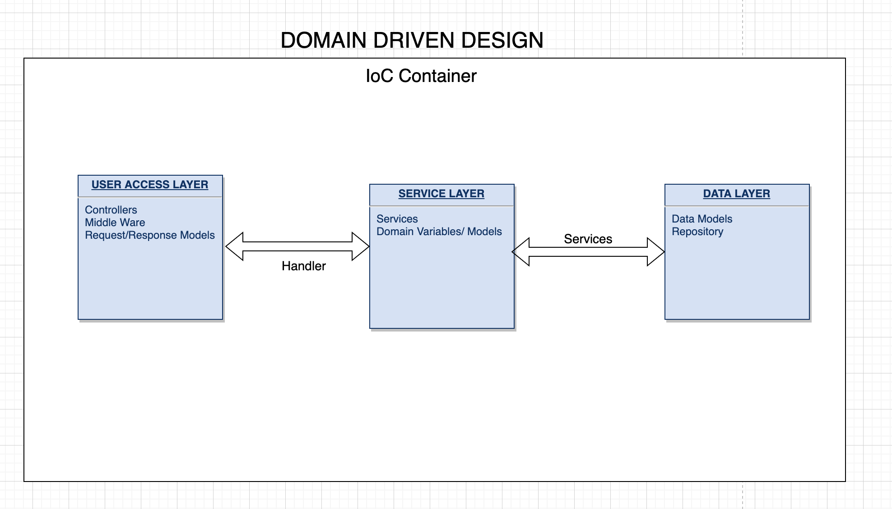
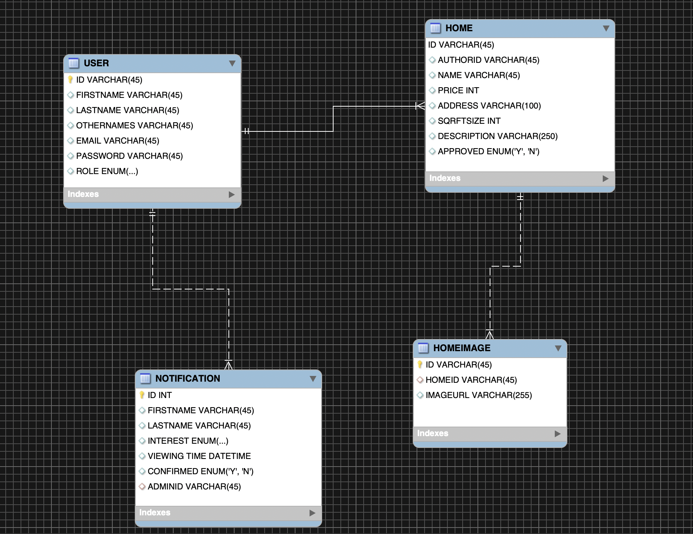

# Properboot

[](https://www.npmjs.com/package/example-typescript-react-component-library) [](https://www.npmjs.com/package/example-typescript-react-component-library)

Properboot application which is properly backend challenge built with [TypeScript](https://github.com/Microsoft/TypeScript) and [Nodejs](https://nodejs.org/en/)

## Project structure

The project contains a `src` directory which is where majority of the application resides with an entry point `server.ts` at the root directory of the src folder
<br />

| Folder         | Description                                                      |
| :------------- | :--------------------------------------------------------------- |
| application    | General application resources to handle users request and models |
| config         | Global application variables stored here or retrieved fron .env  |
| domain         | Domain Models for application                                    |
| infrastructure | Data access layer for application                                |
| migrations     | Postgres Migration Files                                         |

## Key Design Consideration

```sh
# Domain Driven Design
# App wraped in Inversion of Control container - using inversify

```

<br />


<br />

## Setup

```sh
# Install apllication dependencies
npm install

```

## Development

```sh
# Run Locally
npm run start:build && npm run start:run

# Run in Docker
docker build -t properboot:1.0.0 .

#Get docker image from list of images
docker images

#Run docker image
docker run -it -p 8080:8080 <imageId>
```

## Testing

```sh
# Run integration test for application
npm run test
```

## Entity Relationship Diagram


